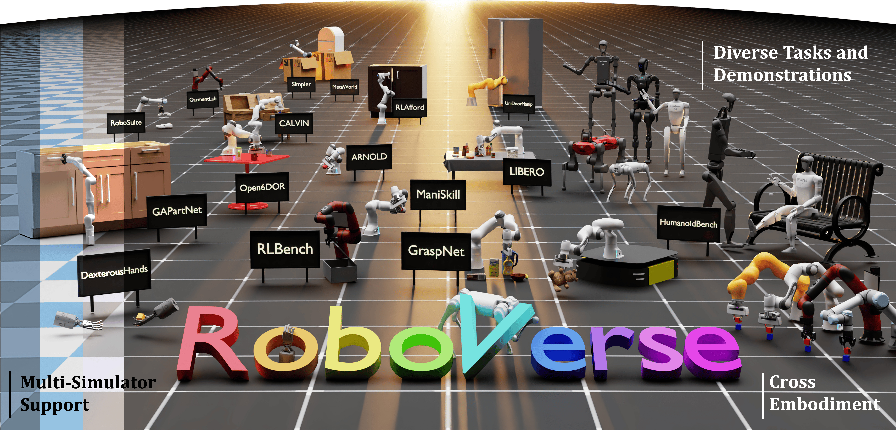

<h1 align="center">MetaSim</h1>

<p align="center">
  <strong>The standalone simulator core for RoboVerse and downstream robotics packages.</strong>
</p>

<p align="center">
  <a href="https://roboverseorg.github.io"></a>
  <a href="https://arxiv.org/abs/2504.18904"></a>
  <a href="https://roboverse.wiki/metasim/"></a>
  <a href="https://github.com/RoboVerseOrg/MetaSim/issues"></a>
  <a href="https://github.com/RoboVerseOrg/MetaSim/blob/main/LICENSE"></a>
</p>



MetaSim provides the common simulation layer used by RoboVerse: simulator handlers, declarative scenario configuration, task registration, package discovery, typed simulation state, queries, domain randomization utilities, protocol simulation utilities, and lightweight example assets. It is designed so a robot-learning workflow can keep its task logic stable while switching between simulator backends.

## Why MetaSim?

- **One interface across simulators**: run the same scenario and task concepts on MuJoCo, Isaac Sim, Isaac Gym, SAPIEN, Genesis, PyBullet, Newton, and other backends.
- **Declarative scene setup**: configure robots, objects, cameras, lights, physics parameters, and rendering through `ScenarioCfg`.
- **Structured state access**: read robot, object, camera, and custom query outputs through a unified tensor state model.
- **Task and Gym integration**: register task wrappers and expose them through the MetaSim task registry or Gymnasium-style APIs.
- **Downstream package friendly**: keep robots, scenes, grounds, and benchmark tasks in content packages while MetaSim stays focused on core simulation abstractions.

## Getting Started

Clone the standalone repository and install the core package with the simulator extra you want to use:

```bash
git clone https://github.com/RoboVerseOrg/MetaSim.git
cd MetaSim

python -m pip install uv
uv pip install -e ".[dev,mujoco,examples]"
```

Run a small example scene:

```bash
python metasim/example/control_test.py --sim mujoco --headless
```

For simulator-specific setup, see the [installation guide](https://roboverse.wiki/metasim/get_started/installation/) and the local docs in [`docs/source/metasim/get_started/installation.rst`](docs/source/metasim/get_started/installation.rst).

## Installation Cheatsheet

Install only the pieces required for your backend or workflow:

| Use case | Command |
| --- | --- |
| Core package | `uv pip install -e .` |
| Core development | `uv pip install -e ".[dev]"` |
| MuJoCo development | `uv pip install -e ".[dev,mujoco,examples]"` |
| Compatible local stack | `uv pip install -e ".[mujoco,sapien3,pybullet]"` |
| Isaac Sim / IsaacLab | See the [installation guide](https://roboverse.wiki/metasim/get_started/installation/) |
| Isaac Gym | See the [installation guide](https://roboverse.wiki/metasim/get_started/installation/) |

Simulator extras are not an arbitrary co-installable matrix. Install each backend in an environment that matches its Python, CUDA, PyTorch, and native-library constraints.

## Supported Simulators

MetaSim tracks backend support in the [support matrix](https://roboverse.wiki/metasim/features/support_matrix/).

| Support level | Backends |
| --- | --- |
| Actively supported | `isaacsim`, `isaacgym`, `mujoco`, `sapien2`, `sapien3`, `genesis`, `pybullet`, `newton` |
| Experimental | `mjx`, `blender` |
| Inactive / release-only | `pyrep` |

## Core Package Scope

MetaSim intentionally does **not** ship RoboVerse task, robot, scene, or ground packs as core package behavior. Downstream projects can register content through:

- installed entry points in `metasim.packages`, `metasim.tasks`, `metasim.robots`, `metasim.scenes`, or `metasim.grounds`
- a local `metasim.toml`
- `[tool.metasim.packages]` in `pyproject.toml`
- `METASIM_PACKAGES`, `METASIM_TASK_PACKAGES`, `METASIM_ROBOT_PACKAGES`, `METASIM_SCENE_PACKAGES`, or `METASIM_GROUND_PACKAGES`

The built-in `metasim.example.example_pack` package is kept lightweight for examples, smoke tests, and documentation snippets.

## Minimal API Sketch

```python
import torch

from metasim.scenario.cameras import PinholeCameraCfg
from metasim.task.registry import get_task_class

task_cls = get_task_class("obj_env")

scenario = task_cls.scenario.update(
    simulator="mujoco",
    num_envs=1,
    headless=True,
    cameras=[PinholeCameraCfg(pos=(1.5, -1.5, 1.5), look_at=(0.0, 0.0, 0.0))],
)

device = torch.device("cuda" if torch.cuda.is_available() else "cpu")
env = task_cls(scenario, device=device)

obs, info = env.reset()
```

The same high-level pattern applies when a downstream package provides richer tasks, robots, scenes, or assets.

## Documentation

- [MetaSim user guide](https://roboverse.wiki/metasim/)
- [Quick-start tutorials](https://roboverse.wiki/metasim/get_started/quick_start/)
- [Architecture overview](docs/source/metasim/concept/architecture.md)
- [Task system](docs/source/metasim/concept/task.md)
- [Package discovery](metasim/utils/package_discovery.py)
- [Autotest guide](docs/source/metasim/developer_guide/autotest.md)

## Development

For general, non-simulator tests:

```bash
pytest metasim/test/ -k general
python -m pip wheel . --no-deps --no-build-isolation -w /tmp/metasim-wheelhouse
```

Simulator-backed tests should be run only in the matching environment described in [`ENVIRONMENTS.md`](ENVIRONMENTS.md) and the [autotest guide](docs/source/metasim/developer_guide/autotest.md).

## Community

- Report MetaSim core bugs through [MetaSim issues](https://github.com/RoboVerseOrg/MetaSim/issues).
- Use the RoboVerse [wish list discussion](https://github.com/RoboVerseOrg/RoboVerse/discussions/categories/wish-list) for broader simulator, task, workflow, or benchmark requests.
- For downstream tasks, assets, learning code, and benchmark packs, see [RoboVerse](https://github.com/RoboVerseOrg/RoboVerse).

## Repository Origin

This repository was split from RoboVerse with Git history preserved for `metasim/`, `docs/source/metasim/`, `pyproject.toml`, and `LICENSE`. The split includes RoboVerse source commit `56ca0d70371c7b5757a62342a061be220849e8a6` plus the local packaging commit that renamed the root distribution to `metasim`.

## License and Acknowledgments

MetaSim is licensed under the Apache License 2.0. See [`LICENSE`](LICENSE).

MetaSim builds on and integrates with the robotics simulation ecosystem, including [Isaac Lab](https://github.com/isaac-sim/IsaacLab), [Isaac Sim](https://docs.isaacsim.omniverse.nvidia.com/latest/index.html), [Isaac Gym](https://developer.nvidia.com/isaac-gym), [MuJoCo](https://github.com/google-deepmind/mujoco), [SAPIEN](https://github.com/haosulab/SAPIEN), [Genesis](https://github.com/Genesis-Embodied-AI/Genesis), [PyBullet](https://github.com/bulletphysics/bullet3), [Newton](https://github.com/newton-physics/newton), [PyRep](https://github.com/stepjam/PyRep), and [Blender](https://www.blender.org/).

## Citation

If you find MetaSim or RoboVerse useful, please cite:

```bibtex
@misc{geng2025roboverse,
      title={RoboVerse: Towards a Unified Platform, Dataset and Benchmark for Scalable and Generalizable Robot Learning},
      author={Haoran Geng and Feishi Wang and Songlin Wei and Yuyang Li and Bangjun Wang and Boshi An and Charlie Tianyue Cheng and Haozhe Lou and Peihao Li and Yen-Jen Wang and Yutong Liang and Dylan Goetting and Chaoyi Xu and Haozhe Chen and Yuxi Qian and Yiran Geng and Jiageng Mao and Weikang Wan and Mingtong Zhang and Jiangran Lyu and Siheng Zhao and Jiazhao Zhang and Jialiang Zhang and Chengyang Zhao and Haoran Lu and Yufei Ding and Ran Gong and Yuran Wang and Yuxuan Kuang and Ruihai Wu and Baoxiong Jia and Carlo Sferrazza and Hao Dong and Siyuan Huang and Yue Wang and Jitendra Malik and Pieter Abbeel},
      year={2025},
      eprint={2504.18904},
      archivePrefix={arXiv},
      primaryClass={cs.RO},
      url={https://arxiv.org/abs/2504.18904},
}
```
