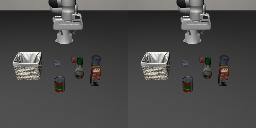
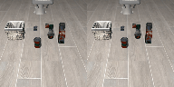

# LIBERO + LIBERO-plus → RoboVerse 1:1 integration

[LIBERO](https://github.com/Lifelong-Robot-Learning/LIBERO) (*Lifelong Robot
Learning*, Liu et al. 2023) is a 130-task manipulation benchmark of robosuite /
MuJoCo environments across five suites (`libero_spatial`, `libero_object`,
`libero_goal`, `libero_10`, `libero_90`).
[LIBERO-plus](https://github.com/sylvestf/LIBERO-plus) (*In-depth Robustness
Analysis of VLA Models*, 2025) is a drop-in superset that expands every suite
with thousands of **perturbation** variants — **10,120 tasks** across seven
dimensions (object layout, camera viewpoint, robot init state, language rewrite,
lighting, background texture, sensor noise).

RoboVerse integrates both as **passthrough** task packs: registration is lazy
and import-safe, and the env is the *native* LIBERO(-plus) `OffScreenRenderEnv`,
so observations / dynamics / 128×128 camera bytes are **bitwise-identical** to
upstream. On top of that we verify a **pure-MetaSim native reproduction** (load
the scene into MetaSim's own MuJoCo handler) and a **bitwise OSC_POSE controller
port** so LIBERO EE-delta policies can run *inside* MetaSim.

Beyond passthrough (which still imports the upstream library), the
`roboverse_pack.tasks.libero.native_libero` pack runs **all 130 base LIBERO tasks
with zero `libero` / `robosuite` import at runtime** — each task loads its own
compiled scene MJCF onto MetaSim's MuJoCo handler, with a robosuite-free OSC
controller and a native BDDL success checker. Mesh assets are resolved from the
deduplicated tree on HuggingFace `RoboVerseOrg/roboverse_data`, so a machine with the
upstream packages **uninstalled** still loads and runs them; the checker is verified
bitwise (0 mismatch vs `env._check_success`) on all 130
(see [Native MetaSim tasks](#native-metasim-tasks-run-and-delete-libero)).

## Status

| Capability | Result | Where |
|---|---|---|
| LIBERO passthrough | **130 / 130** tasks, obs+step bitwise (Δ=0) | `roboverse_pack/tasks/libero/` |
| LIBERO-plus passthrough | **10,120 / 10,120** tasks, state/reward/done bitwise (Δ=0) | `roboverse_pack/tasks/libero_plus/` |
| demo-replay parity | passthrough == native, Δ=0 (380 demos) | `scripts/parity_liberoplus_passthrough.py` |
| asset audit | 7/7 perturbation dims genuinely applied, **0 silent fallback** | `scripts/audit_liberoplus_assets.py` |
| MetaSim MuJoCo migration | 6/6 dims: state-set Δ=0, **engine Δ=0** | `scripts/migrate_liberoplus_metasim.py` |
| OSC_POSE port | **bitwise** — per-state joint-torque Δ = 5.55e-15 N·m | `scripts/osc/` |
| BC policy (closed-loop) | clean 100 % / light 0 % / camera 50 % / noise 75 %; passthrough==native Δ=0 | `scripts/policy/` |
| **Native tasks (no libero/robosuite)** | **130 / 130** base tasks: ported BDDL checker bitwise (0 mismatch vs `env._check_success` over state-replay); `BaseTaskEnv` on MetaSim's handler, discoverable via `get_task_class("libero_native.<task>")` | `roboverse_pack/tasks/libero/native_libero.py` |
| **Vendored assets (library-deletable)** | deduped meshes (~265 MB, shared Franka/arena) on HF; native task loads with `libero`/`robosuite` uninstalled | `RoboVerseOrg/roboverse_data` `libero/assets/` |

MetaSim core changes: **0** (the passthrough reuses the unmodified upstream env;
the MetaSim handler loads the scene MJCF verbatim).

## Environment setup

LIBERO pins `numpy<1.24` / `robosuite==1.4.0` / `bddl==1.0.1` / `mujoco==3.2.3`,
which conflict with the default RoboVerse env — so install each in a **dedicated**
conda env. The passthrough is a safe no-op in any env where LIBERO is not
importable (registration registers nothing; the factory raises a clear error).

```bash
# base LIBERO (130 tasks)
conda create -n libero1to1 python=3.8 -y && conda activate libero1to1
git clone https://github.com/Lifelong-Robot-Learning/LIBERO.git && pip install -e LIBERO

# LIBERO-plus (10,120 tasks) — a separate env; it is a drop-in replacement of LIBERO
conda create -n liberoplus python=3.8 -y && conda activate liberoplus
git clone https://github.com/sylvestf/LIBERO-plus.git && pip install -e LIBERO-plus
# + extract the LIBERO-plus asset bundle (6 GB) into libero/libero/assets
```

The LIBERO-plus passthrough **self-bootstraps** its config: it writes
`~/.libero_plus/config.yaml` pointing at the installed LIBERO-plus package's
bddl / asset / init roots and sets `LIBERO_CONFIG_PATH` (never clobbering a
user-set value or the base `~/.libero`). No manual config editing needed.

## Usage

```python
import roboverse_pack.tasks.libero          # auto-registers Libero/<suite>__<task>
import roboverse_pack.tasks.libero_plus     # auto-registers LiberoPlus/<suite>__<task>
from roboverse_pack.tasks.libero_plus import make_liberoplus_env

# build any of the 10,120 perturbation tasks by (suite, task index)
env = make_liberoplus_env("libero_object", 7, seed=0)
obs, reward, done, info = env.step([0.0] * 7)   # native legacy-gym 4-tuple (kept for fidelity)
```

## Native MetaSim tasks — run (and delete) LIBERO

The passthrough is bitwise but still *imports* `libero` / `robosuite`. The
`roboverse_pack.tasks.libero.native_libero` pack removes that dependency: each task
loads its **own** compiled scene MJCF onto MetaSim's groundless `MujocoHandler`,
drives it with a robosuite-free OSC controller, and judges success natively from the
BDDL goal — with **no `import libero` / `import robosuite` at runtime**. All 130 base
tasks are registered, so they're discoverable through the task registry like any
other RoboVerse task and run with `libero`/`robosuite` uninstalled:

```python
from metasim.task.registry import get_task_class

Task = get_task_class("libero_native.10__KITCHEN_SCENE3_turn_on_the_stove_and_put_the_moka_pot_on_it")
env = Task()                                   # loads the vendored scene; no libero
obs, info = env.reset()
obs, reward, terminated, time_out, info = env.step(action)   # 7-D OSC delta + gripper
```

Each task is a first-class `BaseTaskEnv` (`NativeLiberoEnv`); a static bundle under
`roboverse_pack/tasks/libero/native_bundles/<task>/` holds the libero-free inputs —
`model.xml` (the demo's embedded MJCF), `goal.json` (parsed BDDL `:goal`), `init.npz`
(a demo's initial qpos/qvel). What makes it 1:1:

- **Scene / physics** — the demo's own robosuite-compiled MJCF runs on MetaSim's
  dm_control handler (the same MuJoCo substrate LIBERO uses); engine step is
  bit-for-bit identical and state-replay reproduces the recorded success.
- **BDDL success checker** (`_native_util.check_bddl_success`) — every goal predicate
  reduced to a MuJoCo-state test: `In` = `SiteObject.in_box` (with LIBERO's
  `lb[2]-=0.01` floor slack); `On`(object) = above + contact + xy-aligned;
  `On`(region-site) = `SiteObject.under` **and** contact with the region's parent
  *object* (climbing to the object root; arena-table regions are parentless →
  containment only); `Open`/`Close`/`TurnOn`/`TurnOff` use each object's own
  threshold ranges (open and close are **not** complements — there is a dead zone —
  and close/turn-off require **all** joints). **Verified 0 mismatch vs
  `env._check_success` over demo state-replay on all 130 base tasks.**
- **Control** — `roboverse_pack.tasks.robosuite._osc.NativeOSC`, robosuite's OSC_POSE
  math reimplemented in NumPy (arm + parallel-jaw gripper).

### Vendored assets (library-deletable)

A bundle's `model.xml` references mesh/texture files by path; those are resolved from
the deduplicated tree published to the
[`RoboVerseOrg/roboverse_data`](https://huggingface.co/datasets/RoboVerseOrg/roboverse_data/tree/main/libero)
dataset under `libero/assets/{robosuite,libero}/` (the Franka/arena meshes are shared
by every task — ~265 MB total, not per-task copies). `remap_libero_model` rebases the
roots onto that tree and downloads any missing file from HuggingFace on demand, so on
a machine with `libero`/`robosuite` **uninstalled** the task still loads. Build the
tree with `tools/libero_integration/vendor_shared_assets.py`; override the roots with
`ROBOVERSE_DATA_DIR`, or `LIBERO_ASSETS` / `ROBOSUITE_ASSETS` to point at local
installs.

## Reproduce — run commands

All commands assume `MUJOCO_GL=egl` (headless) and the dedicated env. The
LIBERO-plus runs additionally take `LIBERO_CONFIG_PATH=$HOME/.libero_plus`.

```bash
# --- passthrough bitwise tests (per env) ---
MUJOCO_GL=egl python -m pytest tests/test_libero_passthrough.py -v        # in libero1to1
MUJOCO_GL=egl python -m pytest tests/test_liberoplus_passthrough.py -v    # in liberoplus

# --- LIBERO-plus passthrough == native, all 7 perturbation dimensions ---
LIBERO_CONFIG_PATH=$HOME/.libero_plus MUJOCO_GL=egl \
  python -m scripts.parity_liberoplus_passthrough --per-dim 1 --steps 8

# --- asset audit: prove every perturbation actually changes the render ---
LIBERO_CONFIG_PATH=$HOME/.libero_plus MUJOCO_GL=egl \
  python -m scripts.audit_liberoplus_assets --suites libero_spatial libero_object libero_goal libero_10

# --- migrate the scene into MetaSim's own MuJoCo backend (state + engine 1:1) ---
LIBERO_CONFIG_PATH=$HOME/.libero_plus MUJOCO_GL=egl \
  python -m scripts.migrate_liberoplus_metasim --suite libero_spatial

# --- OSC_POSE controller bitwise parity vs robosuite (for in-MetaSim control) ---
LIBERO_CONFIG_PATH=$HOME/.libero_plus MUJOCO_GL=egl \
  python -m scripts.osc.parity_osc_vs_robosuite --steps 130 --precontact 40

# --- closed-loop BC policy: train (GPU env) then eval through the passthrough (CPU) ---
python -m scripts.policy.train_bc_libero \
  --demos third_party/libero_datasets/libero_object/<task>_demo.hdf5 --epochs 100 \
  --out scripts/policy/ckpt/bc.pt
LIBERO_CONFIG_PATH=$HOME/.libero_plus MUJOCO_GL=egl \
  python -m scripts.policy.eval_bc_liberoplus --ckpt scripts/policy/ckpt/bc.pt \
  --base <task> --suite libero_object --episodes 8

# --- native tasks (no libero/robosuite): vendor shared assets + build bundles ---
MUJOCO_GL=egl LIBERO_CONFIG_PATH=$HOME/.libero_plus \
  python -m tools.libero_integration.vendor_shared_assets  # dedup meshes -> roboverse_data/libero/assets
MUJOCO_GL=egl LIBERO_CONFIG_PATH=$HOME/.libero_plus \
  python -m tools.libero_integration.vendor_native_libero --hdf5 <demo.hdf5> --bddl <task.bddl> --name <task>
# unit tests (checker semantics + a native task runs with NO libero/robosuite):
ROBOVERSE_DATA_DIR=/path/to/roboverse_data MUJOCO_GL=egl \
  python -m pytest tests/test_libero_native.py -v       # in liberoplus
```

## Side-by-side: native LIBERO-plus vs MetaSim

We load each task's own combined MJCF (Franka + objects + arena + camera) into
**MetaSim's MuJoCo handler** and re-render every state of a demo rollout —
proving the MetaSim backend reproduces the *perturbed* LIBERO-plus scene 1:1.
In each clip, **left = native LIBERO-plus `agentview`, right = MetaSim render**;
both are upright and the demo arm motion is identical.

Generated with `scripts/gen_libero_sidebyside.py` (current code, real demo
motion). The animated GIFs below play inline everywhere; the full-quality mp4 is
linked next to each.

**Background-texture perturbation** (`libero_object … _table_5`) — MetaSim
reproduces the swapped scene texture; per-frame native-vs-MetaSim pixel
**MAE = 0.24 / 255** (sub-pixel — renderer config only; state is exact).
[full-quality mp4](../../_static/integrations/libero/sb_liberoplus_texture.mp4)



**Camera-viewpoint perturbation** (`libero_object … _view_…`) — MetaSim
reproduces the shifted camera; per-frame **MAE = 0.16 / 255**.
[full-quality mp4](../../_static/integrations/libero/sb_liberoplus_camera.mp4)



Per-frame `max|qpos − recorded| = 0.0` (state exact); the MetaSim engine step
matches reference MuJoCo to `max|Δ| = 1.6e-4` (`migrate_liberoplus_metasim`).

### Demo-replay parity (all 5 suites)


| suite | tasks | demos | pt-vs-native max\|Δ\| | success (pt / native) |
|---|---|---|---|---|
| libero_spatial | 10 | 50 | **0** | 41/50 · 41/50 |
| libero_object | 10 | 50 | **0** | 43/50 · 43/50 |
| libero_goal | 10 | 50 | **0** | 40/50 · 40/50 |
| libero_10 | 10 | 50 | **0** | 37/50 · 37/50 |
| libero_90 | 90 | 180 | **0** | 154/180 · 154/180 |

The load-bearing number is **passthrough-vs-native = 0** (bitwise across all
380 demos). The ~65 non-successful replays diverge *identically* on both backends
(LIBERO's intrinsic open-loop OSC_POSE replay non-determinism, not a RoboVerse gap).

### OSC_POSE controller parity

`scripts/osc/parity_osc_vs_robosuite.py` reports:

```
(A) per-step torque parity at every real state incl. contact (130 states):
      joint-torque max|Δ| = 5.55e-15 N·m     <- bitwise control-law faithfulness
(B) pre-contact open-loop rollout on MJB-exact model (40 steps):
      arm-qpos max|Δ|     = 1.25e-05 rad
```

The ported `MujocoOSCPose` reuses robosuite's `control_utils` / `transform_utils`
math verbatim, reimplementing only the sim-data access (`mj_fullM`, `mj_jacSite`,
EE pose/vel, `qfrc_bias`) on MetaSim's dm_control `Physics`. It emits joint
torques into the existing `dof_torque` path → additive, opt-in, zero blast radius.

### Real policy robustness (closed-loop, via the passthrough)

An ACT-style BC policy trained on **clean** `libero_object` demos, evaluated
closed-loop on LIBERO-plus perturbations — exactly the robustness signal the
benchmark measures:

| variant | clean | light | sensor-noise | camera |
|---|---|---|---|---|
| success | **8/8 = 1.00** | 0/8 | 6/8 | 4/8 |

`passthrough == native` under the policy: full-rollout state max\|Δ\| = **0**.

## Details and gotchas

- **Config bootstrap.** LIBERO-plus reads bddl/asset/init roots from
  `$LIBERO_CONFIG_PATH/config.yaml` (default `~/.libero`). Because base LIBERO and
  LIBERO-plus share the package name, the passthrough self-writes a dedicated
  `~/.libero_plus` config from the *installed* LIBERO-plus package so the 10k
  perturbation tasks resolve, without touching the base config.
- **Perturbation encoding.** File-based dims (background texture `_table_N`,
  lighting `_light_N`, layout `_add_N`) are real BDDL files; parametric dims
  (camera `_view_…`, robot init `_initstate_…`, language `_language_N`, noise
  `_noise_N`) are synthetic descriptors that the env wrapper parses to apply the
  perturbation — so the passthrough must **not** `os.path.isfile` them; it uses
  the benchmark's authoritative `get_task_bddl_file_path`.
- **Global EGL render context.** robosuite/MuJoCo share a process-global EGL
  context — two `OffScreenRenderEnv` alive at once clobber each other's GL
  textures, so a texture-only perturbation reads as "0 effect". **Render one env
  at a time** (build → render → close). This is required for any side-by-side or
  batched rendering, and is why the asset audit / parity harnesses are sequential.
- **Sensor-noise is upstream-stochastic.** Noise (motion/gaussian/fog/glass blur)
  is added to `agentview_image` *after* render with an unseeded `np.random` — the
  physics/state/reward/done are unaffected (bitwise); only the corrupted image
  differs across interleaved runs. It reproduces when each env runs in isolation.
- **Lossless model transfer.** `env.sim.model.get_xml()` → reload is lossy on
  mesh inertias; the binary `mujoco.mj_saveModel` / `from_binary_path` (MJB) path
  is lossless (inertials Δ=0) — use MJB when an exact MetaSim model is required.
- **OSC sticky orientation goal.** robosuite only updates `goal_ori` when the
  orientation delta is non-zero (a *sticky* goal); the port must match this or it
  drifts under near-zero wrist deltas. With the fix the control law is bitwise.
- **GPU split (sm_120).** The LIBERO sim env pins py3.8 / torch 2.4.1, which can't
  use an sm_120 GPU (RTX 5090). Train policies in an sm_120-capable env (torch
  ≥2.7 / cu128) and run closed-loop eval with CPU inference in the sim env, or via
  a small sim↔policy socket bridge (`scripts/policy/bridge_*`).

## Scope notes (honest)

- The passthrough is **MuJoCo-only by design**: LIBERO is a robosuite/MuJoCo
  benchmark; porting its MJCF to SAPIEN/Newton needs asset re-authoring + a
  different contact model = an approximate cross-sim port, not 1:1.
- The BC policy is a compact single-task demonstration (pipeline + robustness +
  passthrough==native), not a SOTA reproduction. The official
  `Sylvest/openvla-7b-oft-finetuned-libero-plus` checkpoint runs through the same
  bridge for absolute benchmark numbers.
- The native pack's **success checking and physics are bitwise** (checker 0
  mismatch, model fields `max|Δ| = 0`). Its **render** is recompiled from the
  vendored MJCF, so meshes are re-triangulated and shading differs by ~2–5 / 255
  vs robosuite (visually identical); the export path's compiled `model.mjb`
  reproduces the agentview pixel-exactly when that is needed.
- The native pack covers the **130 base tasks**. The 10,120 LIBERO-plus
  perturbations remain passthrough-only (their value is the upstream
  perturbation pipeline; vendoring all of them is future work).
