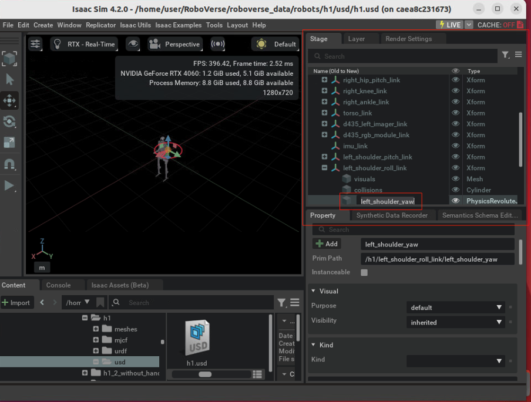

# Contributing New Robots

## 1. Create a Robot Configuration File
Define a new robot configuration in a Python package, for example `my_project/robots/{robot_name}_cfg.py`.

Remember you can always inherit the base robot config class `metasim/scenario/robot.py:RobotCfg`, and add new fields to the robot configs and use it in your own usecase. If you want to add new features to the base config class, be carefull and make sure the feature will be globally available, used by all simulators and multiple scenarios.

<!-- The definition of each term is explained in [API Documentation](https://roboverse.wiki/metasim/api/metasim/metasim.scenario.robot#baserobotcfg). -->

The following fields are mandatory:
- ``num_joints``
- ``actuators``
- ``joint_limits``

The following terms should have at least one of the following, depending on the simulator you want to use:
- ``usd_path``
- ``urdf_path``
- ``mjcf_path``
- ``mjx_mjcf_path``

The following terms are needed if you want to use end-effector control:
- ``ee_body_name``
- ``gripper_open_q``
- ``gripper_close_q``
- ``curobo_ref_cfg_name``
- ``curobo_tcp_rel_pos``
- ``curobo_tcp_rel_rot``


A good example is [franka_cfg.py](https://github.com/RoboVerseOrg/RoboVerse/blob/main/metasim/example/example_pack/robots/franka_cfg.py), which is used by the built-in example package.

Also, please import the robot configuration class from your robot package's `__init__.py`. Please make sure the robot class name is in [camel case](https://en.wikipedia.org/wiki/Camel_case) (e.g. `FrankaPandaCfg`).

MetaSim discovers built-in example robots by default. Additional robot packages are opt-in through entry points, `metasim.toml`, `[tool.metasim.packages]`, or environment variables.

For local development, add a `metasim.toml` file at your project root:

```toml
[packages]
robots = ["my_project.robots"]
```

If your package follows the same layout for multiple content types, use a package root instead:

```toml
[packages]
roots = ["my_project"]
```

`roots` expands to `my_project.tasks`, `my_project.robots`, `my_project.scenes`, and `my_project.grounds`.

## 2. Test the Reliability
Run the following command to test the reliability of the robot:

```bash
python scripts/advanced/random_action.py --sim=${your_simulator} --robot=${robot_name}
```

Please make sure the robot_name is same as above. Either in camel case (e.g. `--robot=FrankaPanda`) or snake case (e.g. `--robot=franka_panda`).

If your robot doesn't break apart and no error occurs during the test, it should be good to use!

## 3. Add the Robot to the RoboVerse Data Repository

Add the robot to the [RoboVerse data repository](https://huggingface.co/datasets/RoboVerseOrg/roboverse_data) by a creating a PR. Please follow the [data structure](https://roboverse.wiki/metasim/developer_guide/data_structure). We thank you for your contribution!

## Tips

### 1. Source of the Robot URDF/MJCF/USD
- For USD, [Isaac Sim Assets](https://docs.isaacsim.omniverse.nvidia.com/latest/assets/usd_assets_robots.html) provides good examples.
- For MJCF, [mujoco_menagerie](https://github.com/google-deepmind/mujoco_menagerie) is a reliable source.

### 2. Joint Names
USD/URDF/MJCF usually define joint names in different ways. If you have multiple formats of a robot and you want to use the cross-simulation feature, please make sure the joint names are consistent.
- To change the joint names in URDF/MJCF, directly edit the URDF/MJCF file with text editor.
- The change the joint names in USD, you need to open it in Isaac Sim (Isaac Lab) GUI, find the joint item in USD tree, and change the name by double-clicking the name.


