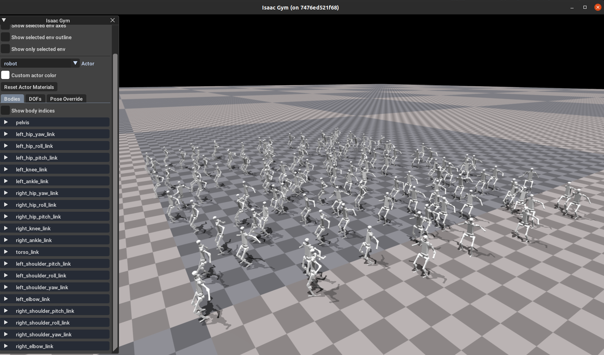
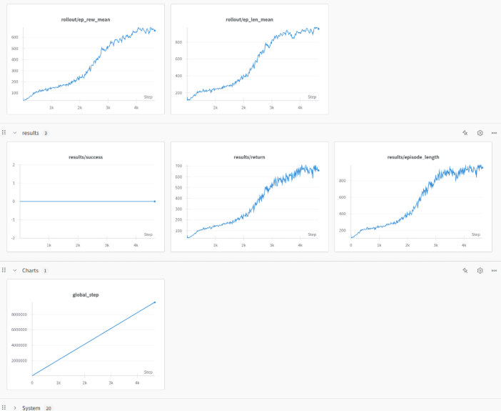

# Humanoidbench RL

We provide a basic RL training example for Humanoidbench tasks.

RL framework: `stable-baselines3`

RL algorithm: `PPO`

Simulator: `MuJoCo` and `IsaacGym` and `IsaacLab`

## Installation

```bash
pip install stable-baselines3
pip install wandb
pip install tensorboard
```

Wandb login, enter your wandb account token.

```bash
wandb login
```

## Training

> NOTE:
> 1. Modify `task: humanoidbench:Stand` in the config files to the task you want to train.
> 2. Modify `use_wandb: true` and `wandb_entity: <your_wandb_entity_name>` in the config files to use wandb to log the training process.

- MuJoCo:

    ```bash
    python roboverse_learn/humanoidbench_rl/train_sb3.py mujoco
    ```


- IsaacGym:

    ```bash
    python roboverse_learn/humanoidbench_rl/train_sb3.py isaacgym
    ```
    After training around 5k steps, you can see result like this
<div style="display: flex; justify-content: space-between; align-items: center;">
    <div style="text-align: center;">
        
        <p>IsaacGym Training</p>
    </div>
    <div style="text-align: center;">
        
        <p>IsaacGym Training Curve</p>
    </div>
</div>


- IsaacLab:

    ```bash
    python roboverse_learn/humanoidbench_rl/train_sb3.py isaaclab
    ```

## Task list

- [ ]  Balance
    - Not Implemented because of collision detection issues.
- [x]  Crawl
- [x]  Cube
- [x]  Door
- [ ]  Highbar
    - Not implemented due to the need to connect H1 and Highbar.
- [ ]  Hurdle
    - Not Implemented because of collision detection issues.
- [ ]   Maze
    - Not Implemented because of collision detection issues.
- [x]  Package
- [ ]  Pole
    - Not Implemented because of collision detection issues.
- [x]  Powerlift
- [x]  Push
- [x]  Run
- [x]  Sit
- [x]  Slide
- [ ]  Spoon
    - Not Implemented because of sensor detection issues.
- [x]  Stair
- [x]  Stand
