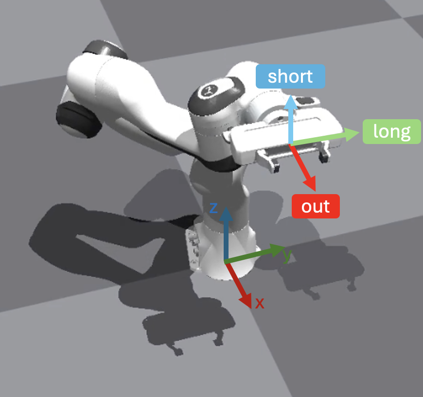

# 0. Franka Planning
## Franka Planning Understanding

Motion Planning is always challenging and complex to tune. Every time you want to plan a motion, you need to tune the rotation convention, the planning library, etc. We provide a simple tutorial to show you how to plan a motion for the Franka robot.

First, you need to install [cuRobo](../../advanced_installation/curobo.md) or [pyroki](https://pyroki-toolkit.github.io/) as motion planning solvers. RoboVerse provides a clean readme to help you install the dependencies. Follow the [advanced installation guide](../../advanced_installation/index.md) to install them.

We provide example code for 2 solvers(curobo and pyroki), specify them with the following command:

```bash
python examples/motion_planning/0_franka_planning.py --sim <simulator> --solver <solver>
```

Here is a visualization of how we plan the motion for the Franka robot:
<div style="text-align: center;">
    
</div>
<br>

You will get the following videos:

<div style="display: flex; flex-wrap: wrap; justify-content: space-between; gap: 10px;">
    <div style="display: flex; justify-content: space-between; width: 100%; margin-bottom: 20px;">
        <div style="width: 32%; text-align: center;">
            <video width="100%" autoplay loop muted playsinline>
                <source src="/metasim/_static/standard_output/motion_planning/0_franka_planning_isaacsim.mp4" type="video/mp4">
            </video>
            <p style="margin-top: 5px;">Isaac Sim</p>
        </div>
        <div style="width: 32%; text-align: center;">
            <video width="100%" autoplay loop muted playsinline>
                <source src="/metasim/_static/standard_output/motion_planning/0_franka_planning_isaacgym.mp4" type="video/mp4">
            </video>
            <p style="margin-top: 5px;">Isaac Gym</p>
        </div>
        <div style="width: 32%; text-align: center;">
            <video width="100%" autoplay loop muted playsinline>
                <source src="/metasim/_static/standard_output/motion_planning/0_franka_planning_genesis.mp4" type="video/mp4">
            </video>
            <p style="margin-top: 5px;">Genesis</p>
        </div>
    </div>

</div>
