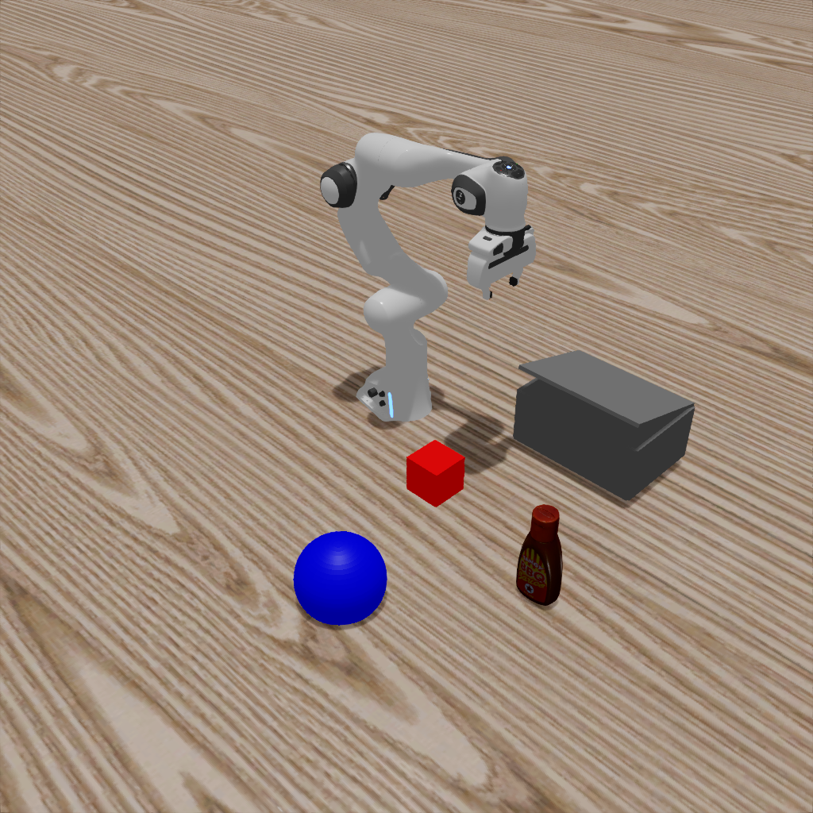
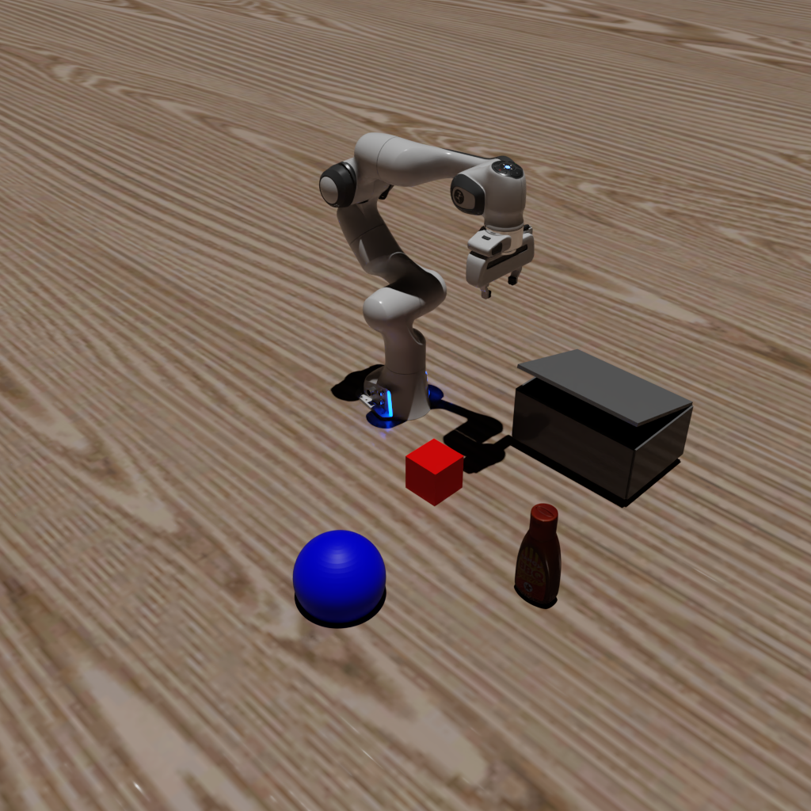

# Tutorial 6: Advanced Rendering

**Objective**: Learn how to use different rendering techniques for varying quality/performance trade-offs.

**What you'll learn**:
- Rasterization vs Ray Tracing vs Path Tracing
- Configuring render modes in MetaSim
- When to use each rendering technique

**Prerequisites**: Completed [Tutorial 5: Hybrid Simulation](5_hybrid_sim)

**Estimated time**: 20 minutes

---

MetaSim supports multiple rendering techniques through Isaac Sim's rendering backend. Choose based on your quality vs performance requirements.

| Technique | `--render.mode` | Quality | Speed | Use Case |
|-----------|-----------------|---------|-------|----------|
| Rasterization | `rasterization` | Good | Fast | Training, real-time |
| Ray Tracing (RTX Real-Time, legacy) | `raytracing` | Great | Medium | Validation, demos |
| Real-Time Path Tracing (RTX Real-Time 2.0) | `realtime_pathtracing` | Great | Medium | Interactive path-traced rendering (recent Isaac Sim) |
| Path Tracing (RTX Interactive) | `pathtracing` | Best | Slow | Final renders, sim2real |

> `realtime_pathtracing` selects Isaac Sim's "RTX - Real-Time 2.0" renderer (`/rtx/rendermode=RealTimePathTracing`). The renderer must be **registered at Kit boot** — it only joins the render-mode list when `/rtx-transient/rt2Enabled` is on (derived at startup from the persistent preference `/persistent/rtx/modes/rt2/enabled`); without registration every `/rtx/rendermode` write is silently refused. MetaSim injects the registration flags into Kit's boot argv when it launches the SimulationApp itself, engages the mode, and verifies via readback (once registered, the mode also switches in/out at runtime). If you hand the handler an already-running `simulation_app`, launch it with `--/persistent/rtx/modes/rt2/enabled=true --/rtx-transient/rt2Enabled=true` yourself. On builds without RTX Real-Time 2.0 MetaSim raises an explicit error so you can fall back to `raytracing` or `pathtracing`.

## Running the Tutorial

```bash
python examples/6_advanced_rendering.py  --render.mode=[rasterization|raytracing|pathtracing|realtime_pathtracing]
```
you can also render in the headless mode by adding `--headless` flag. By using this, there will be no window popping up and the rendering will also be faster.

By running the above command, you will simulate a hybrid system and it will automatically record a video. Here we demonstrate how to use one simulator for physics simulation and another simulator for rendering.


### Examples

#### Ray Tracing
```bash
python examples/6_advanced_rendering.py  --render.mode=raytracing
```

#### Path Tracing
```bash
python examples/6_advanced_rendering.py  --render.mode=pathtracing
```


You will get the following images:
---
| Ray Tracing | Path Tracing |
|:---:|:---:|
|  |  |
